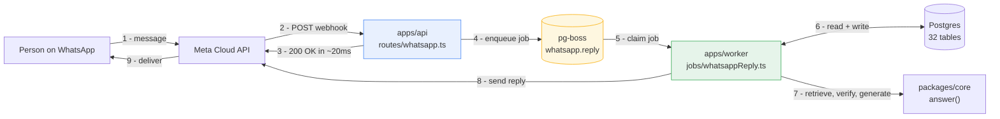
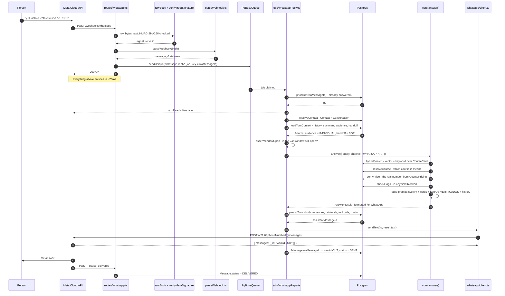
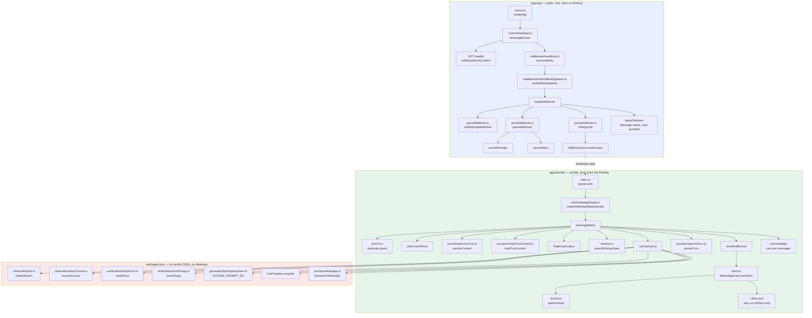
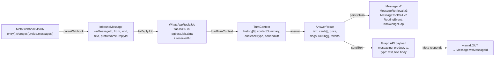
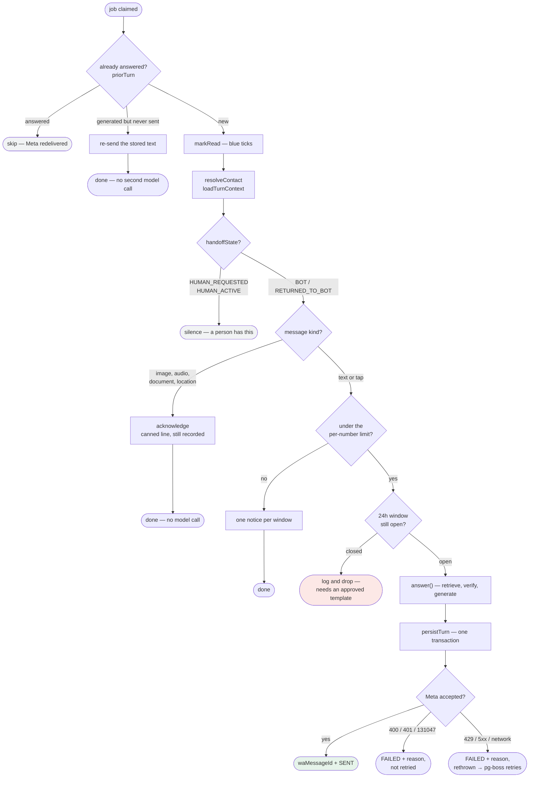
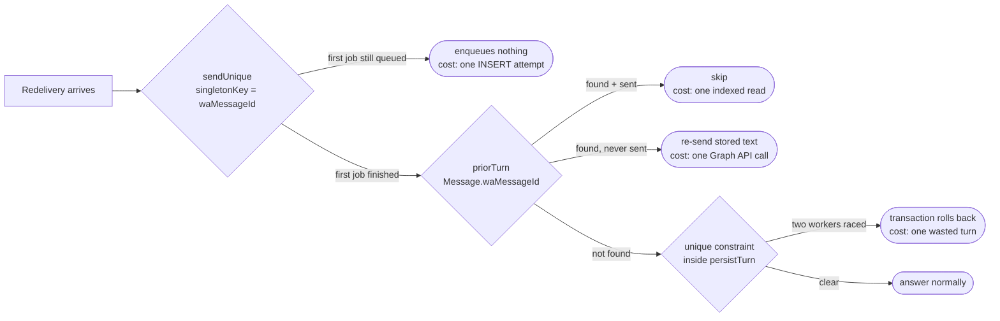
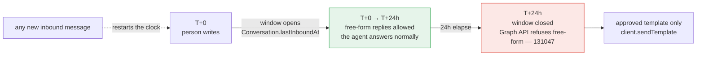
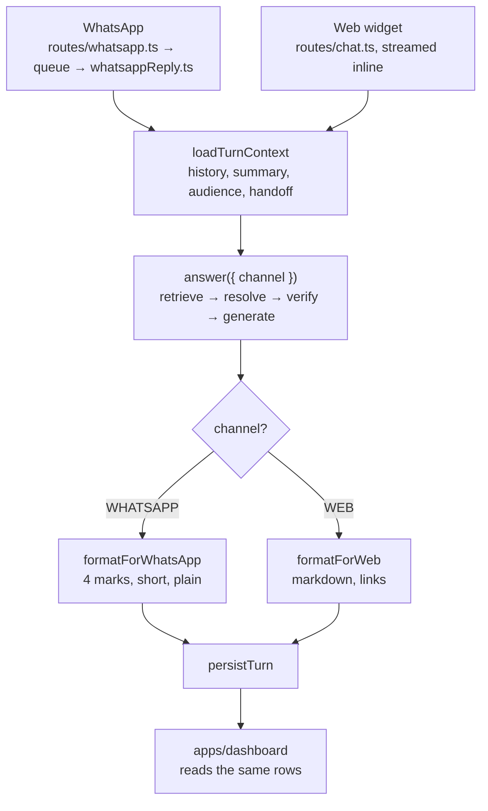

# How the WhatsApp agent actually works

One message, from the moment someone taps send to the moment the answer appears
on their phone — every function it passes through, in order, with what each one
reads and writes.

The diagrams are Mermaid; GitHub renders them inline.

---

## 1. The shape of it

Two processes, one queue between them. That split is the single most important
fact about this design.

**Why not answer inside the webhook.** Meta expects a 2xx within a couple of
seconds; miss it and the delivery is marked failed and redelivered, repeatedly,
and a webhook that stays slow is eventually unsubscribed. A real answer takes
three to five seconds — embed the question, search 104 cards, verify the price
against the database, call Claude. Those two facts cannot both be satisfied on
one thread, so the webhook does nothing but check the signature, write a row,
and answer 200.

---

## 2. One message, end to end

---

## 3. Function by function

Each arrow is a real call. File paths are relative to the repo root.

Note where the arrows stop. `packages/core` never calls the database and never
calls Meta — it is handed a `CardSearchPort` and a `LlmProvider` and asks those.
That is what lets the same `answer()` serve the web widget unchanged, and what
makes the eventual move to Bedrock a config change.

---

## 4. What the data looks like at each hop

### Rows touched, in order

| Step | Table | Operation |
|---|---|---|
| `priorTurn` | `Message` | read by `waMessageId` — the unique column |
| `resolveContact` | `ContactIdentity` | read by `(kind, value)` |
| | `Contact` | create on first contact, with `refCode`, `phoneE164`, `phoneHash` |
| | `Conversation` | reuse the open one, or create |
| profile name | `Contact` | `updateMany` where `fullName IS NULL` — written once, never overwritten |
| `loadTurnContext` | `Conversation` | read `handoffState` |
| | `Message` | read last 6, newest first, reversed |
| | `Contact` | read `summary` |
| | `ContactFact` | read `AUDIENCE_TYPE`, `AUDIENCE_SUBTYPE` where `supersededAt IS NULL` |
| `answer` | `CourseCard` | vector + trigram search |
| | `Course`, `CoursePricing`, `CoursePricePackage` | price verification |
| | `ContentFlag` | compliance flags |
| `persistTurn` | `Message` | create user turn **with `waMessageId`**, and assistant turn |
| | `MessageRetrieval` | one row per card used |
| | `MessageToolCall` | the price and flag lookups — the audit trail |
| | `RoutingEvent` | when the answer hands off to Cruz Roja |
| | `KnowledgeGap` | when the top score was too weak; clustered on the normalised question |
| | `Conversation` | `lastInboundAt`, `lastOutboundAt` — these drive the 24-hour window |
| | `Contact` | `lastSeenAt`, `messageCount += 2`, `lastIntent` |
| `sendAndRecord` | `Message` | assistant row gets `waMessageId` and `status` |
| receipts | `Message` | `status` advanced to `DELIVERED` / `READ` |

Everything from `persistTurn` down happens in **one transaction**. An answer
that was sent but whose routing event was lost is worse than no record at all —
the dashboard would show a handled question that nobody is handling.

---

## 5. The decisions inside the worker

Seven branches before the model is ever called. Six of them end the turn.

---

## 6. Why a redelivery cannot answer twice

Meta redelivers anything it believes failed — including deliveries that
succeeded but answered slowly. Three guards, in order of cost:

The third guard is why `persistTurn` writes `waMessageId` inside its
transaction rather than in an update afterwards. Written after, two workers
racing on the same message both pass the check and both reply.

---

## 7. The 24-hour window

WhatsApp is not email. Once a person messages the business, Meta opens a
24-hour window in which any free-form reply is allowed. After it closes,
free-form sends are refused with error **131047**, and the only way to reach
that person is an approved template.

Checking it before an inbound reply looks redundant — the window opened on the
very message being answered. It is not: a job on its third pg-boss retry, or one
that queued behind an outage, can run well after the message arrived. Without
the check, that turn burns an embedding call and a Claude call and then fails at
the Graph API with an error that reads like an authentication problem.

The arithmetic lives in one file, `packages/channels/src/whatsapp/window.ts`,
because three places need it: the worker before sending, the dashboard's
countdown, and any future admin "send a manual reply" route.

---

## 8. Failure, and what happens to it

| What fails | What happens | Who finds out |
|---|---|---|
| Bad or missing signature | 403, nothing enqueued | `warn` line with the request id |
| Wrong verify token on the handshake | 403 plain text | `warn` line; Meta shows the URL as unverified |
| Queue insert fails | 500 → **Meta redelivers** | `error` line; the message is not lost |
| Payload is not from WhatsApp | 200 `ignored` | `warn` — someone subscribed another product |
| Delivery receipt write fails | swallowed, answer unaffected | `warn` |
| Embedding or Claude call fails | job throws → 2 retries with backoff | `error` with `jobId` and `waMessageId` |
| `persistTurn` fails | nothing sent, job retries | `error`; no unauditable reply exists |
| Graph API 429 / 5xx | 3 attempts inside the client, then the job retries | `warn` per attempt |
| Graph API 400 / 401 / 131047 | `Message.status = FAILED` with the reason, **no retry** | `error` naming the Meta code |
| Window closed before the job ran | dropped, not retried | `error` with when it expired |
| Conversation handed to a human | nothing sent, job succeeds | `info` |

Two log conventions worth knowing: phone numbers are always masked to their last
four digits, and the message body is never logged — it is the customer's own
words, and once the answer quotes a price it is the client's commercial terms.

---

## 9. Both channels, one brain

The channels differ in three things and three things only: how the message
arrives, how the answer is formatted, and how it leaves. Retrieval, price
verification, compliance flags, the prompt and the audit trail are the same code
for both — which is the point. If the same question got two different answers
depending on where it was asked, that would be a bug in the middle, not
something either channel gets to fix locally.

---

## 10. Reading order, if you are new to this

1. `packages/channels/src/whatsapp/parseWebhook.ts` — what Meta actually sends
2. `apps/api/src/routes/whatsapp.ts` — the two-second rule in practice
3. `apps/worker/src/jobs/whatsappReply.ts` — the turn, top to bottom
4. `packages/core/src/generation/answer.ts` — the part that was already there
5. `scripts/checkpoint10-whatsapp.ts` — how to prove all of it works
